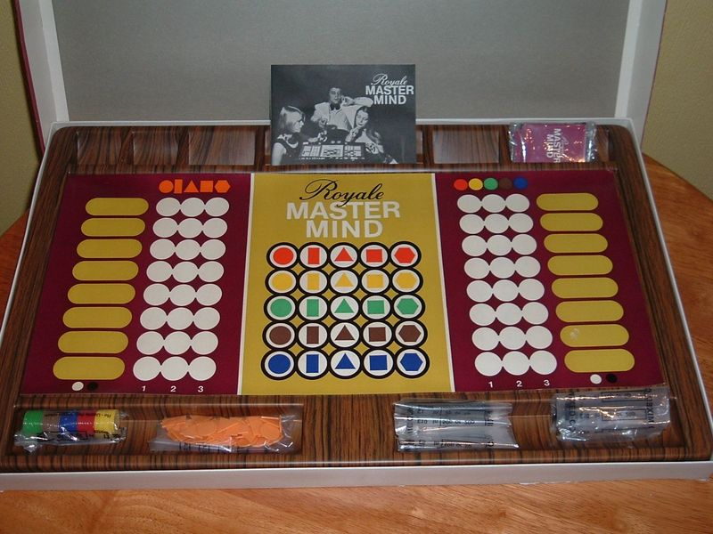
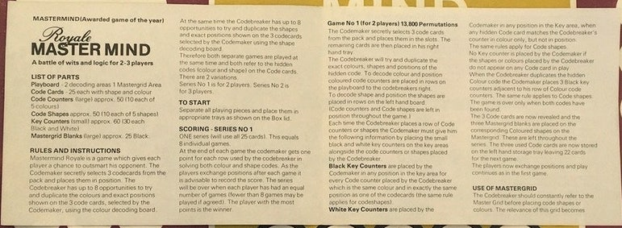
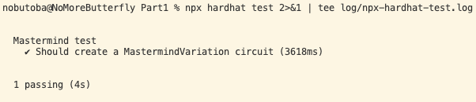
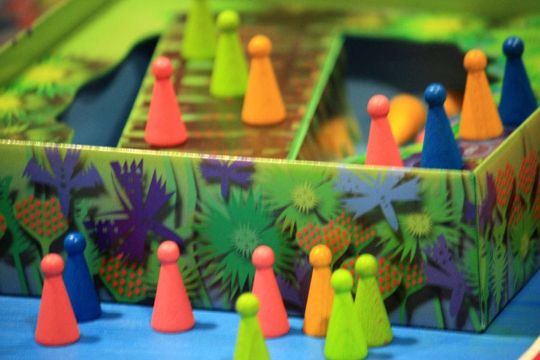
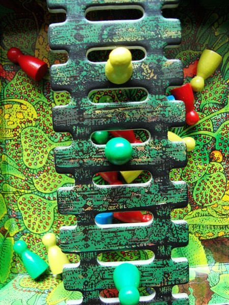
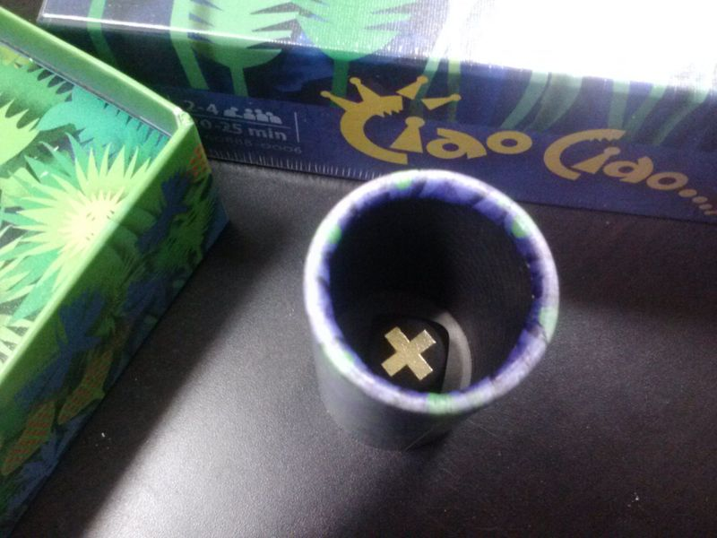
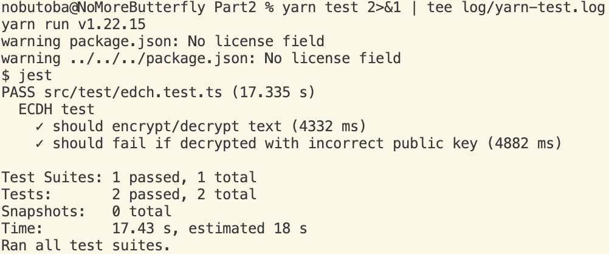

# Week 2 Assignment

1. Enrolled email address: tba
1. Discord handle (e.g. cs#6500): tba

## Part 1. Circom in games

### Part 1 Q1

> In `Part1/contracts/circuits/`, `hitandblow.circom` is a circuit that implements the simple Hit & Blow (aka Mastermind) game adapted from [here](https://github.com/enu-kuro/zku-final-project/blob/main/circuits/hitandblow.circom) and [here](https://github.com/weijiekoh/zkmm/blob/master/mastermind/circuits/mastermind.circom). Watch [this](https://www.youtube.com/watch?v=5jtcsBERDEQ) for how Mastermind is played. Mastermind is a game with a relatively small solution space (*4-6* colors in 4 positions), which means even with ZK, we can easily compute proofs for all *256-1296* permutations. **What have the authors done in their implementations to protect them from brute-force attacks?**

In short terms, the authors prevent brute-force attacks through the use of [cryptographic salts](https://en.wikipedia.org/wiki/Salt_(cryptography)).
Indeed, in their circuit implementations, they use private input signals called
[`privSaltedSoln`](https://github.com/weijiekoh/zkmm/blob/62da47b78a104114a767ae0c61ac7654c95ea58d/mastermind/circuits/mastermind.circom#L21)
(`weijiekoh/zkmm`) and
[`privSalt`](https://github.com/enu-kuro/zku-final-project/blob/cd16bc155772b34e0bbf94c2c4cc1cd70cb3d906/circuits/hitandblow.circom#L22)
(`enu-kuro/zku-final-project`), respectively.

In the latter implementation by `enu-kuro`,
which is more close to the implementation [`hitandblow.circom`](./Part1/contracts/circuits/hitandblow.circom),
the author [Poseidon-hashes](https://github.com/enu-kuro/zku-final-project/blob/cd16bc155772b34e0bbf94c2c4cc1cd70cb3d906/circuits/hitandblow.circom#L91-L99) the private input signals `privSolnA`, `privSolnB`, `privSolnC`, and `privSolnD` together with `privSalt` to obtain the output signal `solnHashOut` of the circuit; schematically,

```text
solnHashOut = poseidon(privSalt, privSolnA, privSolnB, privSolnC, privSolnD).
```

If there was no salt and we instead had

```text
solnHashOut = poseidon(privSolnA, privSolnB, privSolnC, privSolnD),
```

the codebreaker could prepare a
[rainbow table](https://en.wikipedia.org/wiki/Rainbow_table) consisting of `poseidon(iA, iB, iC, iD)`
for `i*` of `[0, ..., 9]`
(note that each `privSoln*` is constrained to be [less than 10](https://github.com/enu-kuro/zku-final-project/blob/cd16bc155772b34e0bbf94c2c4cc1cd70cb3d906/circuits/hitandblow.circom#L43-L45)),
so the implementation would be vulnerable to brute-force attacks.
Since `privSolnA`, ..., `privSolnD` actually must have
[distinct values](https://github.com/enu-kuro/zku-final-project/blob/cd16bc155772b34e0bbf94c2c4cc1cd70cb3d906/circuits/hitandblow.circom#L52-L55),
**an attacker would only have to compute `10 * 9 * 8 * 7 = 5040` hash values**.

However, in the presence of the private input signal `privSalt`,
brute-force attacks are infeasible since a malicious codebreaker would have to take into account all the possibilities of adding salts;
**a potential attacker would then have to compute `5040 * p` hash values where `p` is [the large prime](https://docs.circom.io/circom-language/basic-operators/#field-elements)**.
In other words, a brute-force attack against the implementation is at least as difficult as to reverse the (univariate) Poseidon hash function.

### Part 1 Q2

> In `contracts/circuits/MastermindVariation.circom`, implement a [variation of Mastermind from Wikipedia](https://en.wikipedia.org/wiki/Mastermind_(board_game)#Variations) of your choice. Apply your learning from Q1 to protect your circuit from brute-force attacks.

I choose Royale Mastermind.

- Local link: [`contracts/circuits/MastermindVariation.circom`](./Part1/contracts/circuits/MastermindVariation.circom)
- Playboard:

    

- Quote from [boardgamegeek.com](https://boardgamegeek.com/boardgame/22989/royale-mastermind): *"**Royale Mastermind** is a variant of Mastermind where two players solve 8 patterns, alternating between being the knower and the guesser. Shapes and colors are guessed independently on each side of the board. The total number of guesses each player requires to solve the color/shape pattern is tallied, the winner being the one to take the fewest guesses. The patterns consist of three elements, each having one of five shapes and one of five colors. A deck of 25 cards is used to establish the pattern, and after each card is used in a puzzle, it is not used again. The corresponding shape/color is also covered on a grid in the center of the board so the players can use this information in future rounds."*

- Half of the rules from [etsy.com](https://www.etsy.com/il-en/listing/771482918/vintage-royale-master-mind-board-game):

    

- Command:

    ```bash
    cd Part1
    mkdir log
    npm install 2>&1 | tee log/npm-install.log
    npm install --save-dev circom_tester circomlibjs 2>&1 | tee ./log/npm-install-circom_tester.log
    cd contracts/circuits
    circom MastermindVariation.circom 2>&1 | tee ../../log/circom.log
    ```

- Log:

  - [npm-install.log](./Part1/log/npm-install.log)
  - [npm-install-circom_tester.log](./log/../Part1/log/npm-install-circom_tester.log)
  - [circom.log](./Part1/log/circom.log)

### Part 1 Q3

> In `test/mastermind-test.js`, write unit tests to test the functionality of your circuit from Q2. **You should perform unit tests on the circuit itself (using `circom_tester`, see example [here](https://gist.github.com/socathie/b9cadb33a0a9efe4131663f2bcf69637) and [here](https://github.com/iden3/circomlib/tree/master/test)), NOT the verifier smart contract.** Attach a screenshot of your unit tests passing.

- Local link: [`test/mastermind-test.js`](./Part1/test/mastermind-test.js)
- Command:

  ```bash
  cd Part1
  bash scripts/compile-circuit.sh 2>&1 | tee log/compile-circuit.log
  node scripts/bump-solidity.js 2>&1 | tee log/bump-solidity.log
  npx hardhat test 2>&1 | tee log/npx-hardhat-test.log
  ```

- Log:

  - [`compile-circuit.log`](./Part1/log/compile-circuit.log)
  - [`bump-solidity.log`](./Part1/log/bump-solidity.log)
  - [`npx-hardhat-test.log`](./Part1/log/npx-hardhat-test.log)

- Screenshot:

    

### Part 1 Q4

> There are many games that could benefit from the privacy ZK offers and can be protected from brute-force attacks using the same technique. Previous graduates have built the classic [Hangman](https://github.com/russel-ra/zk-hangman) and [Battleship](https://github.com/CDDelta/battleship3), as well as some original games such as [zkAutoChess](https://github.com/HKerStanley/zkautochess) and [zkWitches](https://github.com/ThanksSkeleton/zkwitches_backend) for their final projects. Suggest / Design a game and explain (1) how it is played, (2) how it can benefit from ZK, (3) how it can be implemented with ZK, (4) how it is protected from brute-force attacks.

I suggest a board game called "Ciao, Ciao...". References:

- [boardgamegeek.com](https://boardgamegeek.com/boardgame/1163/ciao-ciao)

- [YouTube](https://www.youtube.com/watch?v=A3EKA3t37Z4)

#### Part 1 Q4 (1): How it is played

*According to the rules, "the coolest player wins". This is a bluffing game in which players try to move their pawns safely across a bridge. The bridge spans a swamp full of hungry, carnivorous plants (the inside of the game box). This tiny boardgame is contained within the box — the box is entirely covered, inside and out, with the riotous, hungry swamp. A secret dice mechanism provides opportunity for skillful bluffing. A sharp little game.*

1. A current player secretly rolls a die. She does not reveal the number on the die to the other players until she is requested to do so.
2. The current player claims that the number on the die is `i` where `i` is 1, 2, 3, or 4. She may or may not tell the actual number.
3. One of the following cases must happen:

    1. All the other players accept her claim.
    2. One of the other players challenges her claim.

4. In the first case, the current player moves her pawn `i` steps forward, without revealing the actual number on the die.

     

5. In the second case, the current player must reveal the actual number on the die.

    1. If her claim is true, then the current player moves her pawn `i` steps forward, and the player who challenged her claim loses his pawn.
    2. If her claim is false, then the opposite happens; the current player loses her pawn, and the player who challenged her claim moves his pawn `i` steps forward.

    

#### Part 1 Q4 (2): How it can benefit from ZK

In Ciao-Ciao, a player at her turn plays the role of a prover and the others the role of a verifier.
Indeed, a current player has to convince the other players that she properly rolled a die, without revealing the actual number on it.
In the original board game, players are able to prove that they properly rolled a die through the use of a cylinder-shaped, opaque dice case.



#### Part 1 Q4 (3): How it can be implemented with ZK

To implement Ciao-Ciao, we have to take care of secret randomness, resembling the dice rolled within the opaque cylinder. At each turn, we may proceed as follows:

1. The current player privately picks a random number `privNumInit` between 0 and 5 (inclusive) together with a random salt `privSalt`. She then publishes the hash value

    ```text
    poseidon(privSalt, privNumInit)
    ```

    to the other players.
1. Every other player publishes a random number between 0 and 5 (inclusive).
These random numbers constitute an array `pubNums` of length equal to the total number of players minus one.
1. The sum `privNumFin` of `privNumInit` and all the elements of the array `pubNums` modulo 6,

   ```text
    privNumFin = (privNumInit + sum(...pubNums)) % 6,
   ```

   represents a secret number  on the die which is visible only to the current player.

#### Part 1 Q4 (4): How it is protected from brute-force attacks

As in the Mastermind example, we use cryptographic salts to prevent brute-force attacks.

### Part 1 Q5

> [bonus] Implement the circuit for your game from Q4 in `contracts/circuits/bonus.circom`.

- Local link: [`contracts/circuits/bonus.circom`](./Part1/contracts/circuits/bonus.circom)

### Part 1 Q6

> [bonus] Write unit tests in `test/bonus-test.js` to test your Q5 circuit.

- Local link: [`test/bonus-test.js`](./Part1/test/bonus-test.js)

## Part 2. Anti-collusion and Fairness

### Part 2 Q1

> [MACI](https://github.com/appliedzkp/maci/blob/master/specs/01_introduction.md) (Minimum Anti-Collusion Infrastructure) was proposed by Vitalik Buterin as an attempt to tackle [collusion on the blockchain](https://vitalik.ca/general/2019/04/03/collusion.html). After reading about MACI, answer the following questions:

#### Part 2 Q1.1

> Summarize how MACI works in 2-4 sentences of simple English.

#### Part 2 Q1.2

> What kind of collusion(s) does MACI solve?

#### Part 2 Q1.3

> What kind of collusion(s) or attack(s) does MACI not solve?

### Part 2 Q2

> In [appliedzkp/maci/crypto/ts/index.ts](https://github.com/appliedzkp/maci/blob/master/crypto/ts/index.ts), MACI is using [ECDH](https://cryptobook.nakov.com/asymmetric-key-ciphers/ecdh-key-exchange) for encrypting messages, but using an older version of circomlib. iden3 has since released [circomlibjs](https://github.com/iden3/circomlibjs), which is a Javascript library that provides programs to compute the witness of several circuits of `circomlib`. In this question, we will get familiar with the `circomlibjs` library which will come in handy when we build our own app:

For clarity, I henceforth refer to a specific
[commit](https://github.com/privacy-scaling-explorations/maci/tree/3e26d930ecb8e25fef0ab3c52f0177a3a9dde0b2)
on MACI.
This commit is the latest one at the time of writing.

#### Part 2 Q2.1

> In `Part2/`, run `yarn` to install all dependencies.

- Command:

    ```bash
    cd Part2
    mkdir log
    yarn 2>&1 | tee log/yarn.log
    ```

- Log: [yarn.log](./Part2/log/yarn.log)

#### Part 2 Q2.2

> In `src/index.ts`, fill in the code for `encrypt` and `decrypt` functions so that the unit tests will pass. (*Hint: you do NOT need to write this from scratch, you just need to understand the original code in MACI and transcribe it to the new `circomlibjs` syntax.*)

- Link to the original code in MACI for the `encrypt` and `decrypt` functions: [privacy-scaling-explorations/maci/crypto/ts/index.ts](https://github.com/privacy-scaling-explorations/maci/blob/3e26d930ecb8e25fef0ab3c52f0177a3a9dde0b2/crypto/ts/index.ts#L241-L283)
- Local link: [`src/index.ts`](./Part2/src/index.ts)

#### Part 2 Q2.3

> Attach a screenshot of the tests passing in your PDF file.

- Command:

    ```bash
    cd Part2
    yarn test 2>&1 | tee log/yarn-test.log
    ```

- Log: [yarn-test.log](./Part2/log/yarn-test.log)

- Screenshot:

    

### Part 2 Q3

> Explain in 1-3 sentences why, in computing VDFs, having many computers operating in parallel won't help you to find the solution more quickly.

### Part 2 Q4

> There are many ways to achieve blind auctions (aka sealed-bid auctions). [ZK Blind Auction](https://github.com/heivenn/zk-blind-auction) creates blind auctions that only show a bidder's address and hashed bid, but would require a centralized server to record the current bids and rely on an auctioneer to run the proof to get the winning bid. Let’s try to improve the design:

#### Part 2 Q4.1

> Think of and explain an upgraded design of ZK Blind Auction that eliminates the need for a centralized server while maintaining the privacy of the bid value, i.e. only the bidder knows their own bid value. Assume that a multi-phase design is possible and we can somehow incentivize the bidders to come back and submit multiple proofs/transactions.

#### Part 2 Q4.2

> One way to ensure the bidders will come back to reveal their bid values and/or claim the auction item is to make them deposit at the time of bidding. Propose a scheme so that bidders can pre-deposit some tokens at the time of bidding without revealing their bidding value. (If they deposit their bid value on a blockchain, then it will be known to the public.)

## Part 3. Time to start thinking about your final project!

> Designing your final project is more than just the circuit(s)! Take this [PvP version of Mastermind](https://github.com/enu-kuro/zku-final-project) as an example. Even though there are already existing circuits out there, you still have to design the game mechanism, the smart contract(s), and the frontend to ensure the game works properly for the users.

### Part 3 Q1

> Suppose you are building the auction application from Part 2 Q4.1 and the circuit is already built for you. Write down an implementation plan, including what other components you will need to build, the order in which you will build your components, as well as what frameworks/tools you will use.

### Part 3 Q2

> Suggest three candidate ideas for your final project. Explain (1) the problem tackled, (2) a design overview, and (3) obstacles anticipated in approx. 200 words for each idea.

#### Part 3 Q2 Idea 1

The Ciao-Ciao game from Part 1 Q4.

#### Part 3 Q2 Idea 2

ZK-arXiv, or DarXiv. A blockchain-based preprint system where researchers can prove that they have accomplished certain work without revealing the contents.

#### Part 3 Q2 Idea 3
